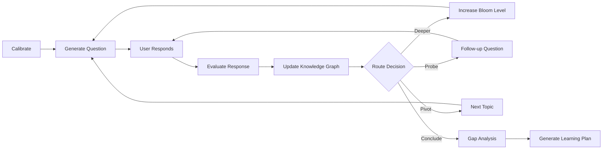
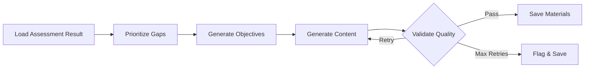

# OpenLearning

[](https://github.com/onegunsamurai/OpenLearning/actions/workflows/ci.yml)
[](https://onegunsamurai.github.io/OpenLearning)
[](https://opensource.org/licenses/MIT)
[](https://discord.gg/ekTFZpgPdE)

AI-powered learning engineering platform. Identify skill gaps and generate personalized learning plans.

Most learning platforms treat assessment as a static quiz. OpenLearning uses a LangGraph-powered adaptive interview that calibrates to your level, targets specific Bloom taxonomy depths, and builds a knowledge graph in real time — then generates a personalized learning plan from the gaps it finds.

## Features

- **Onboarding** — Browse roles or select skills manually
- **Skill Assessment** — Adaptive AI interview with calibration, Bloom-level targeting, and knowledge graph construction
- **Gap Analysis** — Radar chart visualization comparing current vs target proficiency with priority-ranked gaps
- **Learning Plan** — Phased, structured learning plan with theory, quiz, and lab modules
- **User Dashboard** — View assessment history, resume incomplete assessments, and revisit past results

## Assessment Pipeline



The assessment uses a LangGraph state machine with human-in-the-loop interrupts. It calibrates difficulty with 3 initial questions, then adaptively routes through topics using Bloom taxonomy levels (remember, understand, apply, analyze, evaluate, create) until it has evaluated up to 8 topics or 25 questions.

## Content Generation Pipeline



After assessment completion, a background pipeline generates personalized learning materials. Gaps are scored by severity, Bloom distance, and IRT weight, then content is generated in parallel (up to 5 concurrent) with Bloom-level validation. Each piece must pass a quality gate (bloom alignment >= 0.75, quality >= 0.70) or gets regenerated up to 3 times.

## Getting Started

### Prerequisites

- Python 3.11+
- Node.js 18+
- An Anthropic API key

### Setup

```bash
# Install all dependencies
make install

# Configure backend
cp backend/.env.example backend/.env
# Edit backend/.env and set ANTHROPIC_API_KEY

# Configure frontend
cp frontend/.env.example frontend/.env.local

# Run both servers
make dev
```

- Frontend: [http://localhost:3000](http://localhost:3000)
- Backend: [http://localhost:8000](http://localhost:8000)
- API docs: [http://localhost:8000/api/docs](http://localhost:8000/api/docs)

### Docker Setup

Run the entire stack with Docker — no local Python or Node.js required:

```bash
# Copy env file and set your API key
cp backend/.env.example backend/.env
# Edit backend/.env and set ANTHROPIC_API_KEY

# Production-like mode
make docker-up

# Development mode (hot-reload)
make docker-dev
```

| Variable | File | Description |
|----------|------|-------------|
| `ANTHROPIC_API_KEY` | `backend/.env` | Anthropic API key (optional: can be set through UI) |
| `CORS_ORIGINS` | `backend/.env` | Allowed CORS origins (default: `http://localhost:3000`) |
| `DATABASE_URL` | `backend/.env` | SQLAlchemy database URL (PostgreSQL via `asyncpg`) |
| `GITHUB_CLIENT_ID` | `backend/.env` | GitHub OAuth app client ID (optional, for auth) |
| `GITHUB_CLIENT_SECRET` | `backend/.env` | GitHub OAuth app client secret (optional, for auth) |
| `JWT_SECRET_KEY` | `backend/.env` | Secret key for signing JWT tokens (optional, for auth) |
| `ENCRYPTION_KEY` | `backend/.env` | Fernet key for encrypting stored API keys (optional, for auth) |
| `FRONTEND_URL` | `backend/.env` | Frontend URL for OAuth redirects (default: `http://localhost:3000`) |
| `LANGSMITH_API_KEY` | `backend/.env` | LangSmith API key (optional, for tracing) |
| `LANGSMITH_PROJECT` | `backend/.env` | LangSmith project name (default: `open-learning`) |
| `LANGSMITH_TRACING` | `backend/.env` | Enable LangSmith tracing (default: `false`) |
| `NEXT_PUBLIC_API_URL` | `frontend/.env.local` | Backend URL for the frontend (default: `http://localhost:8000`) |

To stop containers: `make docker-down`
To stop and remove all data: `make docker-clean`


## Tech Stack

- **Backend**: Python FastAPI + LangGraph + LangChain + Anthropic Claude
- **Database**: SQLAlchemy + asyncpg (PostgreSQL)
- **Frontend**: Next.js 16 (App Router), TypeScript
- **Styling**: Tailwind CSS v4 + Radix UI + shadcn/ui
- **State**: Zustand (sessionStorage persistence)
- **Charts**: Recharts
- **Animations**: Motion v12

## Architecture

```
OpenLearning/
├── backend/
│   ├── app/
│   │   ├── main.py              # FastAPI app, CORS, router mounts
│   │   ├── config.py            # Settings (API key, CORS origins)
│   │   ├── db.py                # SQLAlchemy models, async DB
│   │   ├── models/              # Pydantic models (OpenAPI source of truth)
│   │   ├── routes/              # API endpoints
│   │   ├── services/            # AI service layer
│   │   ├── agents/              # LLM agents (calibrator, evaluator, etc.)
│   │   ├── graph/               # LangGraph pipeline, state, router
│   │   ├── knowledge_base/      # Domain YAML files + loader
│   │   ├── data/                # Skills taxonomy
│   │   └── prompts/             # System prompts for Claude
│   ├── tests/
│   ├── Dockerfile               # Backend container image
│   ├── .dockerignore            # Docker build exclusions
│   ├── requirements.txt
│   └── pyproject.toml
├── frontend/
│   ├── src/
│   │   ├── app/                 # Next.js pages (no API routes)
│   │   ├── components/          # UI components
│   │   ├── hooks/               # Custom hooks
│   │   └── lib/                 # Types, store, API client
│   ├── Dockerfile               # Frontend container image
│   ├── .dockerignore            # Docker build exclusions
│   └── package.json
├── scripts/
│   ├── export-openapi.py        # Export OpenAPI spec from FastAPI app
│   ├── generate-api.sh          # OpenAPI → TypeScript types
│   ├── forbid-env-files.sh      # Pre-commit hook: block .env file commits
│   └── lint-frontend-staged.sh  # Pre-commit hook: lint staged frontend files
├── docker-compose.yml           # Production-like Docker Compose config
├── docker-compose.dev.yml       # Development Docker Compose overrides
└── Makefile
```

### API Endpoints

| Method | Path                              | Description                        |
|--------|-----------------------------------|------------------------------------|
| GET    | /api/health                       | Health check with DB probe         |
| GET    | /api/skills                       | List all skills and categories     |
| GET    | /api/roles                        | List available roles               |
| GET    | /api/roles/{role_id}              | Get role details and skills        |
| POST   | /api/assessment/start             | Start assessment session           |
| POST   | /api/assessment/{id}/respond      | Submit answer (SSE streaming)      |
| GET    | /api/assessment/{id}/graph        | Get current knowledge graph        |
| GET    | /api/assessment/{id}/report       | Get full assessment report         |
| GET    | /api/assessment/{id}/export       | Export assessment report           |
| GET    | /api/assessment/{id}/resume       | Resume incomplete assessment       |
| POST   | /api/gap-analysis                 | Generate gap analysis              |
| POST   | /api/learning-plan                | Generate learning plan             |
| GET    | /api/auth/github                  | Initiate GitHub OAuth login        |
| GET    | /api/auth/github/callback         | GitHub OAuth callback              |
| GET    | /api/auth/me                      | Get current user info              |
| POST   | /api/auth/logout                  | Log out (clear session)            |
| POST   | /api/auth/api-key                 | Store encrypted API key            |
| GET    | /api/auth/api-key                 | Check if API key is stored         |
| DELETE | /api/auth/api-key                 | Delete stored API key              |
| POST   | /api/auth/validate-key            | Validate an API key                |
| POST   | /api/auth/register                | Register with email/password       |
| POST   | /api/auth/login                   | Sign in with email/password        |
| GET    | /api/user/assessments             | List user's assessment sessions    |
| GET    | /api/materials/{session_id}       | Get generated learning materials   |

### Type Generation

Generate TypeScript types from the backend OpenAPI spec:

```bash
# With backend running
make generate-api
```

## Documentation

Full documentation is available at **[https://onegunsamurai.github.io/OpenLearning](https://onegunsamurai.github.io/OpenLearning)**.

To preview docs locally:

```bash
pip install -r docs/requirements.txt
make docs-serve
```

## Contributing

See [CONTRIBUTING.md](CONTRIBUTING.md) for development setup, coding standards, and how to submit pull requests.

We welcome knowledge base contributions (new domain YAML files) from domain experts — no Python or TypeScript required.

## License

This project is licensed under the MIT License — see the [LICENSE](LICENSE) file for details.
