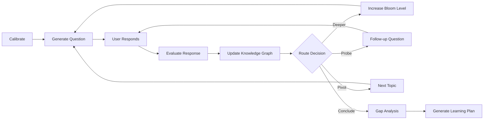

# OpenLearning

[](https://github.com/onegunsamurai/OpenLearning/actions/workflows/ci.yml)
[](https://opensource.org/licenses/MIT)

AI-powered learning engineering platform. Identify skill gaps and generate personalized learning plans.

Most learning platforms treat assessment as a static quiz. OpenLearning uses a LangGraph-powered adaptive interview that calibrates to your level, targets specific Bloom taxonomy depths, and builds a knowledge graph in real time — then generates a personalized learning plan from the gaps it finds.

## Features

- **Onboarding** — Paste a job description to auto-extract skills, or browse and select manually
- **Skill Assessment** — Adaptive AI interview with calibration, Bloom-level targeting, and knowledge graph construction
- **Gap Analysis** — Radar chart visualization comparing current vs target proficiency with priority-ranked gaps
- **Learning Plan** — Phased, structured learning plan with theory, quiz, and lab modules

## Assessment Pipeline



The assessment uses a LangGraph state machine with human-in-the-loop interrupts. It calibrates difficulty with 3 initial questions, then adaptively routes through topics using Bloom taxonomy levels (remember, understand, apply, analyze, evaluate, create) until it has evaluated up to 8 topics or 25 questions.

## Getting Started

### Prerequisites

- Python 3.11+
- Node.js 18+
- An Anthropic API key

### Setup

```bash
# Install all dependencies
make install

# Configure backend
cp backend/.env.example backend/.env
# Edit backend/.env and set ANTHROPIC_API_KEY

# Configure frontend
cp frontend/.env.example frontend/.env.local

# Run both servers
make dev
```

- Frontend: [http://localhost:3000](http://localhost:3000)
- Backend: [http://localhost:8000](http://localhost:8000)
- API docs: [http://localhost:8000/api/docs](http://localhost:8000/api/docs)

## Tech Stack

- **Backend**: Python FastAPI + LangGraph + LangChain + Anthropic Claude
- **Database**: SQLAlchemy + aiosqlite (SQLite)
- **Frontend**: Next.js 16 (App Router), TypeScript
- **Styling**: Tailwind CSS v4 + Radix UI + shadcn/ui
- **State**: Zustand (sessionStorage persistence)
- **Charts**: Recharts
- **Animations**: Motion v12

## Architecture

```
OpenLearning/
├── backend/
│   ├── app/
│   │   ├── main.py              # FastAPI app, CORS, router mounts
│   │   ├── config.py            # Settings (API key, CORS origins)
│   │   ├── db.py                # SQLAlchemy models, async DB
│   │   ├── models/              # Pydantic models (OpenAPI source of truth)
│   │   ├── routes/              # API endpoints
│   │   ├── services/            # AI service layer
│   │   ├── agents/              # LLM agents (calibrator, evaluator, etc.)
│   │   ├── graph/               # LangGraph pipeline, state, router
│   │   ├── knowledge_base/      # Domain YAML files + loader
│   │   ├── data/                # Skills taxonomy
│   │   └── prompts/             # System prompts for Claude
│   ├── tests/
│   ├── requirements.txt
│   └── pyproject.toml
├── frontend/
│   ├── src/
│   │   ├── app/                 # Next.js pages (no API routes)
│   │   ├── components/          # UI components
│   │   ├── hooks/               # Custom hooks
│   │   └── lib/                 # Types, store, API client
│   └── package.json
├── scripts/
│   └── generate-api.sh          # OpenAPI → TypeScript types
└── Makefile
```

### API Endpoints

| Method | Path                              | Description                        |
|--------|-----------------------------------|------------------------------------|
| GET    | /api/skills                       | List all skills and categories     |
| POST   | /api/parse-jd                     | Extract skills from job desc       |
| POST   | /api/assessment/start             | Start assessment session           |
| POST   | /api/assessment/{id}/respond      | Submit answer (SSE streaming)      |
| GET    | /api/assessment/{id}/graph        | Get current knowledge graph        |
| GET    | /api/assessment/{id}/report       | Get full assessment report         |
| POST   | /api/gap-analysis                 | Generate gap analysis              |
| POST   | /api/learning-plan                | Generate learning plan             |

### Type Generation

Generate TypeScript types from the backend OpenAPI spec:

```bash
# With backend running
make generate-api
```

## Documentation

Full documentation is available at **[https://onegunsamurai.github.io/OpenLearning](https://onegunsamurai.github.io/OpenLearning)**.

To preview docs locally:

```bash
pip install mkdocs-material
make docs-serve
```

## Contributing

See [CONTRIBUTING.md](CONTRIBUTING.md) for development setup, coding standards, and how to submit pull requests.

We welcome knowledge base contributions (new domain YAML files) from domain experts — no Python or TypeScript required.

## License

This project is licensed under the MIT License — see the [LICENSE](LICENSE) file for details.
