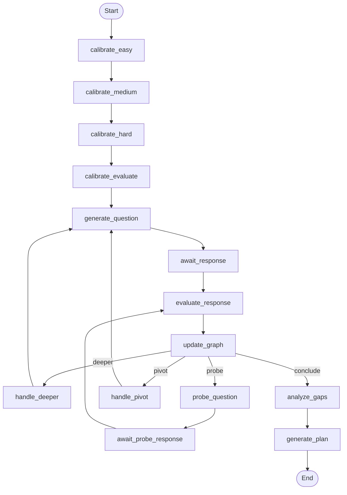
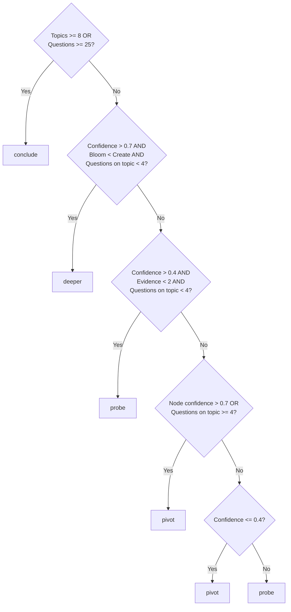

# Assessment Pipeline

The assessment pipeline is a LangGraph state machine that adaptively evaluates a candidate's knowledge across multiple topics and Bloom taxonomy levels. This page covers every node, routing decision, and data structure in the pipeline.

**Source**: `backend/app/graph/pipeline.py`, `backend/app/graph/router.py`, `backend/app/graph/state.py`

## Pipeline Overview

The pipeline has **16 nodes** organized into four phases:



## Phase 1: Calibration

Three calibration questions at increasing difficulty determine the candidate's starting level.

### Nodes

| Node | Agent | Description |
|------|-------|-------------|
| `calibrate_easy` | `calibrator.generate_calibration_question` | Generates an easy question, interrupts for response |
| `calibrate_medium` | `calibrator.generate_calibration_question` | Generates a medium question, interrupts for response |
| `calibrate_hard` | `calibrator.generate_calibration_question` | Generates a hard question, interrupts for response |
| `calibrate_evaluate` | `calibrator.evaluate_calibration` | Evaluates all 3 responses to determine starting level |

### Calibration Evaluation

The evaluator receives all three Q&A pairs and returns:

- **`calibrated_level`** — One of `junior`, `mid`, `senior`, `staff`
- **`initial_concepts`** — Seed nodes for the knowledge graph (concept, confidence, bloom_level)
- **`first_topic`** — The first topic to assess in the main loop

Each calibration node uses LangGraph's `interrupt()` to pause execution and wait for the user's answer. When the user responds via the API, the graph resumes from the checkpoint.

### Level → Starting Bloom Mapping

| Calibrated Level | Starting Bloom Level |
|-----------------|---------------------|
| Junior | Understand |
| Mid | Apply |
| Senior | Analyze |
| Staff | Evaluate |

## Phase 2: Assessment Loop

The core loop generates questions, evaluates responses, updates the knowledge graph, and routes to the next action.

### Nodes

| Node | Agent | Description |
|------|-------|-------------|
| `generate_question` | `question_generator.generate_question` | Generates a question for the current topic and Bloom level |
| `await_response` | — | Interrupts for user input |
| `evaluate_response` | `response_evaluator.evaluate_response` | Evaluates accuracy, depth, and demonstrated Bloom level |
| `update_graph` | `knowledge_mapper.update_knowledge_graph` | Updates knowledge graph node with weighted confidence |

### Question Generation

The question generator receives:

- Current topic and Bloom level
- Calibrated level (for difficulty calibration)
- Number of questions already asked on this topic
- Previously used question types (to avoid repetition)
- Last 5 questions (for context)

It returns a question with one of four types:

| Type | Description |
|------|-------------|
| `conceptual` | Explain a concept, definition, or relationship |
| `scenario` | Apply knowledge to a real-world situation |
| `debugging` | Identify and fix issues in a described system |
| `design` | Design a solution or architecture |

### Response Evaluation

The evaluator scores each response on:

- **`confidence`** (0.0–1.0) — How well the candidate demonstrated understanding
- **`bloom_level`** — The actual Bloom level demonstrated (may differ from the target)
- **`evidence`** — Specific observations supporting the score

### Knowledge Graph Update

When a response is evaluated, the knowledge graph is updated:

- **Existing node**: Weighted merge — `new_confidence = 0.7 * old + 0.3 * new`
- **New node**: Created with evaluation confidence, prerequisites from target graph
- **Bloom level**: Takes the higher of existing vs. newly demonstrated level
- **Evidence**: Appended to existing evidence list
- **Edges**: Prerequisite edges are added for new nodes

## Phase 3: Routing

After each knowledge graph update, the router determines the next action.

**Source**: `backend/app/graph/router.py`

### Decision Tree



### Routing Constants

| Constant | Value | Purpose |
|----------|-------|---------|
| `MAX_TOPICS` | 8 | Maximum topics to evaluate before concluding |
| `MAX_TOTAL_QUESTIONS` | 25 | Hard limit on total questions |
| `HIGH_CONFIDENCE` | 0.7 | Threshold for "high confidence" routing |
| `MAX_QUESTIONS_PER_TOPIC` | 4 | Maximum questions on a single topic |
| `MIN_EVIDENCE_FOR_CONFIDENCE` | 2 | Minimum evidence items before trusting confidence |

### Route Actions

| Route | What Happens | Next Node |
|-------|-------------|-----------|
| **`deeper`** | Advance to next Bloom level on same topic | `handle_deeper` → `generate_question` |
| **`probe`** | Generate follow-up question on same topic at same level | `probe_question` → `await_probe_response` → `evaluate_response` |
| **`pivot`** | Mark topic as evaluated, select next unevaluated topic | `handle_pivot` → `generate_question` |
| **`conclude`** | Assessment complete, proceed to analysis | `analyze_gaps` |

### Topic Selection (Pivot)

When pivoting, the router selects the next topic by:

1. Getting all topics from the knowledge base for the candidate's domain and target level
2. Filtering out already-evaluated topics
3. Picking the first unevaluated topic (preserving prerequisite order from the YAML)

The starting Bloom level for the new topic is determined by the calibrated level (same mapping as Phase 1).

## Phase 4: Conclusion

### Gap Analysis

**Source**: `backend/app/agents/gap_analyzer.py`

Pure Python (no LLM call). Compares the current knowledge graph against the target graph:

- A **gap** exists where `current_confidence < target_confidence - 0.2`
- Gaps are **topologically sorted** by prerequisites so foundational concepts come first

### Learning Plan Generation

**Source**: `backend/app/agents/plan_generator.py`

Claude generates a phased learning plan from the gap nodes:

- **3–5 phases** respecting prerequisite order
- Mixed resource types: articles, videos, projects, exercises
- Realistic hour estimates per phase
- Rationale for grouping and ordering

## Bloom Taxonomy Integration

The six Bloom levels form the core difficulty progression:

```
remember → understand → apply → analyze → evaluate → create
```

**Defined in**: `backend/app/graph/state.py` as `BloomLevel(StrEnum)`

The pipeline uses Bloom levels in three ways:

1. **Question targeting** — Questions are generated at a specific Bloom level
2. **Response evaluation** — The evaluator identifies the *demonstrated* Bloom level
3. **Difficulty progression** — The "deeper" route advances to the next Bloom level

## Human-in-the-Loop

The pipeline uses LangGraph's `interrupt()` at every point where user input is needed:

- 3 calibration question nodes
- `await_response` node (main assessment)
- `await_probe_response` node (follow-up questions)

Each interrupt sends metadata to the frontend:

```json
{
  "type": "calibration | assessment",
  "question": { "id": "...", "topic": "...", "bloomLevel": "...", "text": "...", "questionType": "..." },
  "topicsEvaluated": 3,
  "totalQuestions": 12,
  "maxQuestions": 25
}
```

The pipeline state is persisted to SQLite via `AsyncSqliteSaver`, so assessments survive server restarts.
