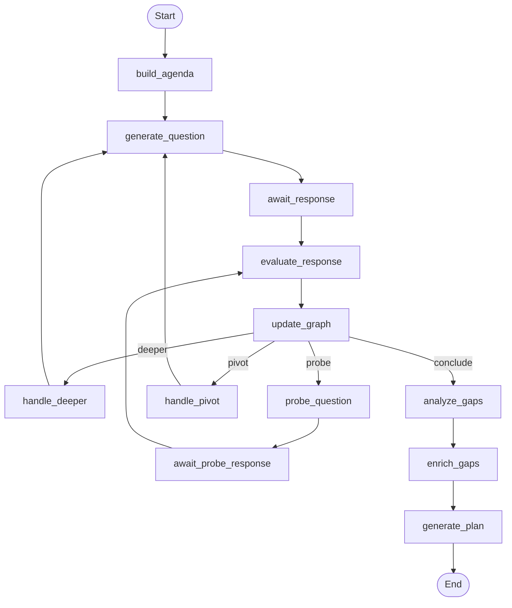

# Assessment Pipeline

The assessment pipeline is a LangGraph state machine that adaptively evaluates a candidate's knowledge across multiple topics and Bloom taxonomy levels. This page covers every node, routing decision, and data structure in the pipeline.

**Source**: `backend/app/graph/pipeline.py`, `backend/app/graph/router.py`, `backend/app/graph/state.py`

## Pipeline Overview

The pipeline has **12 nodes** organized into three phases:



## Phase 1: Agenda Building

The pipeline begins by building the topic agenda and generating the first assessment question directly.

### Nodes

| Node | Agent | Description |
|------|-------|-------------|
| `build_agenda` | `pipeline.build_agenda_node` | Builds the topic agenda from the knowledge base using the `target_level` and selects the first topic |

### Target Level → Starting Bloom Mapping

The `target_level` provided by the user determines the starting Bloom level for the assessment:

| Target Level | Starting Bloom Level |
|-------------|---------------------|
| Junior | Understand |
| Mid | Apply |
| Senior | Analyze |
| Staff | Evaluate |

## Phase 2: Assessment Loop

The core loop generates questions, evaluates responses, updates the knowledge graph, and routes to the next action.

### Nodes

| Node | Agent | Description |
|------|-------|-------------|
| `generate_question` | `question_generator.generate_question` | Generates a question for the current topic and Bloom level |
| `await_response` | — | Interrupts for user input |
| `evaluate_response` | `response_evaluator.evaluate_response` | Evaluates accuracy, depth, and demonstrated Bloom level |
| `update_graph` | `knowledge_mapper.update_knowledge_graph` | Updates knowledge graph node with weighted confidence |

> The assessment loop also uses routing nodes (`handle_deeper`, `handle_pivot`) and probe nodes (`probe_question`, `await_probe_response`) described in Phase 3 below.

### Question Generation

The question generator receives:

- Current topic and Bloom level
- Target level (for difficulty targeting)
- Number of questions already asked on this topic
- Previously used question types (to avoid repetition)
- Last 5 questions (for context)

It returns a question with one of four types:

| Type | Description |
|------|-------------|
| `conceptual` | Explain a concept, definition, or relationship |
| `scenario` | Apply knowledge to a real-world situation |
| `debugging` | Identify and fix issues in a described system |
| `design` | Design a solution or architecture |

### Response Evaluation

The evaluator scores each response on:

- **`confidence`** (0.0–1.0) — How well the candidate demonstrated understanding
- **`bloom_level`** — The actual Bloom level demonstrated (may differ from the target)
- **`evidence`** — Specific observations supporting the score

### Knowledge Graph Update

When a response is evaluated, the knowledge graph is updated:

- **Existing node**: Weighted merge — `new_confidence = 0.7 * old + 0.3 * new`
- **New node**: Created with evaluation confidence, prerequisites from target graph
- **Bloom level**: Takes the higher of existing vs. newly demonstrated level
- **Evidence**: Appended to existing evidence list
- **Edges**: Prerequisite edges are added for new nodes

## Phase 3: Routing

After each knowledge graph update, the router determines the next action.

**Source**: `backend/app/graph/router.py`

### Nodes

| Node | Description |
|------|-------------|
| `handle_deeper` | Advances Bloom level before generating next question on the same topic |
| `handle_pivot` | Marks topic as evaluated and switches to the next unevaluated topic |
| `probe_question` | Generates a probing follow-up question on the same topic at the same Bloom level |
| `await_probe_response` | Interrupts for user response to the probe question |

### Decision Tree


### Routing Constants

| Constant | Value | Purpose |
|----------|-------|---------|
| `MAX_TOPICS` | 10 | Maximum topics to evaluate before concluding |
| `MAX_TOTAL_QUESTIONS` | dynamic | `min(agenda_length, MAX_TOPICS) * max_questions_per_topic` |
| `HIGH_CONFIDENCE` | 0.7 | Threshold for "high confidence" routing |
| `MAX_QUESTIONS_PER_TOPIC` | 4 | Maximum questions on a single topic |
| `MIN_EVIDENCE_FOR_CONFIDENCE` | 2 | Minimum evidence items before trusting confidence |

### Route Actions

| Route | What Happens | Next Node |
|-------|-------------|-----------|
| **`deeper`** | Advance to next Bloom level on same topic | `handle_deeper` → `generate_question` |
| **`probe`** | Generate follow-up question on same topic at same level | `probe_question` → `await_probe_response` → `evaluate_response` |
| **`pivot`** | Mark topic as evaluated, select next unevaluated topic | `handle_pivot` → `generate_question` |
| **`conclude`** | Assessment complete, proceed to analysis | `analyze_gaps` |

### Topic Selection (Pivot)

When pivoting, the router selects the next topic by:

1. Getting all topics from the knowledge base for the candidate's domain and target level
2. Filtering out already-evaluated topics
3. Picking the first unevaluated topic (preserving prerequisite order from the YAML)

The starting Bloom level for the new topic is determined by the target level (same mapping as Phase 1).

## Conclusion

### Gap Analysis

**Source**: `backend/app/agents/gap_analyzer.py` → `analyze_gaps()`

Pure Python (no LLM call). Compares the current knowledge graph against the target graph:

- A **gap** exists where `current_confidence < target_confidence`
- Gaps are **topologically sorted** by prerequisites so foundational concepts come first

### Gap Enrichment

**Source**: `backend/app/agents/gap_enricher.py` → `enrich_gaps()`

Enriches the raw gap nodes with priority tiers, overall readiness, and LLM-generated recommendations:

- **`overall_readiness`** (0–100) — Weighted average of current/target confidence across all concepts
- **`priority`** — Per-gap tier based on confidence gap: `critical` (>0.6), `high` (>0.4), `medium` (>0.2), `low`
- **`recommendation`** — LLM-generated actionable learning recommendation per gap (via `GapEnrichmentOutput` schema)
- Gaps are sorted by priority (critical first), then by gap size

Returns an `EnrichedGapAnalysis` stored in the `enriched_gap_analysis` state field.

### Learning Plan Generation

**Source**: `backend/app/agents/plan_generator.py` → `generate_plan()`

Claude generates a phased learning plan from the gap nodes:

- **3–5 phases** respecting prerequisite order
- Mixed resource types: articles, videos, projects, exercises
- Realistic hour estimates per phase
- Rationale for grouping and ordering

## Bloom Taxonomy Integration

The six Bloom levels form the core difficulty progression:

```
remember → understand → apply → analyze → evaluate → create
```

**Defined in**: `backend/app/graph/state.py` as `BloomLevel(StrEnum)`

The pipeline uses Bloom levels in three ways:

1. **Question targeting** — Questions are generated at a specific Bloom level
2. **Response evaluation** — The evaluator identifies the *demonstrated* Bloom level
3. **Difficulty progression** — The "deeper" route advances to the next Bloom level

## Human-in-the-Loop

The pipeline uses LangGraph's `interrupt()` at every point where user input is needed:

- `await_response` node (main assessment)
- `await_probe_response` node (follow-up questions)

Each interrupt sends metadata to the frontend:

**Assessment interrupt** (`type: "assessment"`, used by both `await_response` and `await_probe_response`):
```json
{
  "type": "assessment",
  "question": { "id": "...", "topic": "...", "bloomLevel": "...", "text": "...", "questionType": "..." },
  "topics_evaluated": 3,
  "total_questions": 12,
  "max_questions": 25
}
```

The pipeline state is persisted to PostgreSQL via `AsyncPostgresSaver`, so assessments survive server restarts.

## LLM Integration

All agent LLM calls go through a shared integration layer that provides structured output, automatic retry, and observability.

**Source**: `backend/app/services/ai.py`, `backend/app/agents/schemas.py`

### Structured Output

Agents use LangChain's `with_structured_output()` instead of regex-based JSON parsing. Each agent defines a Pydantic schema in `backend/app/agents/schemas.py` that the LLM must conform to:

| Schema | Agent | Purpose |
|--------|-------|---------|
| `QuestionOutput` | Question Generator | Assessment question |
| `EvaluationOutput` | Response Evaluator | Response confidence, Bloom level, evidence |
| `PlanOutput` | Plan Generator | Full learning plan with phases and resources |
| `GapEnrichmentOutput` | Gap Enricher | Summary and per-gap recommendations |
| `GapRecommendationOutput` | Gap Enricher | Single concept recommendation (nested in `GapEnrichmentOutput`) |

Agents call `ainvoke_structured(schema, prompt)`, which returns a validated Pydantic instance. The agent then maps this to the pipeline's `CamelModel` state types.

### Retry with Exponential Backoff

Transient LLM failures (timeouts, rate limits, 5xx errors) are retried automatically:

- **Max attempts**: 3
- **Backoff**: Exponential with jitter (`wait_exponential_jitter=True`)
- **Retryable errors**: `APITimeoutError`, `RateLimitError`, `InternalServerError`
- **Non-retryable**: `AuthenticationError` and validation errors fail immediately

### Structured Logging

Every LLM call emits structured log entries via the `openlearning.llm` logger:

- **Success**: agent name, duration (ms), schema name
- **Retry**: agent name, attempt number, error type and message
- **Failure**: agent name, duration (ms), schema name, error type and message
