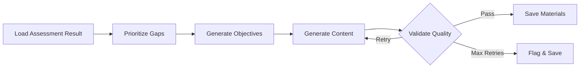
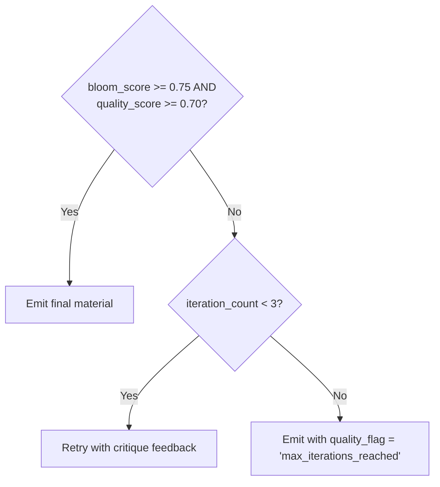

# Learning Content Pipeline

The learning content pipeline is a LangGraph StateGraph that automatically generates personalized learning material from assessment results. It consumes the structured output of the assessment pipeline — knowledge gaps, Bloom levels, confidence scores, and evidence — and produces validated, Bloom-aligned content for each gap.

**Source**: `backend/app/graph/content_pipeline.py`, `backend/app/graph/content_state.py`, `backend/app/agents/content_nodes.py`

## Pipeline Overview

The pipeline has **5 nodes** organized into four phases:



> Nodes 1–3 (`input_reader`, `gap_prioritizer`, `objective_generator`) run sequentially per session. Node 4 (`generate_all_content`) runs in parallel across all gaps via `asyncio.gather` with a semaphore of 5. Node 5 (`validate_all_content`) runs per gap with a retry loop (up to 3 iterations).

### Components

| Component | Technology | Role |
|-----------|-----------|------|
| State management | LangGraph StateGraph + PostgreSQL checkpointer | Persists pipeline state across nodes |
| Gap input | `AssessmentResult` (JSONB) | Source of `gap_nodes`, knowledge graph, evidence |
| Taxonomy lookup | `TaxonomyIndex` (in-memory singleton from YAML) | `bloom_target`, `target_confidence`, prerequisites |
| IRT config | `concept_config` (PostgreSQL table) | Per-concept difficulty weights |
| Knowledge retrieval | pgvector | Domain knowledge for RAG generation |
| LLM calls | Claude claude-sonnet-4-6 via Anthropic API | Content generation and Bloom validation |
| Output storage | `material_result` (PostgreSQL JSONB) | Final generated material per gap |

> This pipeline does not replace the assessment system. It is a downstream consumer of `AssessmentResult` records. The two systems share a PostgreSQL database and the domain taxonomy YAML, but operate on separate LangGraph threads.

## Scientific Foundations

Each node is grounded in a specific body of educational or ML research:

| Framework | Where Used | Purpose |
|-----------|-----------|---------|
| **Bloom's Taxonomy** (Anderson & Krathwohl, 2001) | Objective Generator, Bloom Validator | Action verb selection, cognitive level targeting, alignment validation |
| **Knowledge Space Theory** (Doignon & Falmagne, 1985) | Objective Generator | Prerequisite topological sort via Kahn's algorithm |
| **Cognitive Load Theory** (Sweller, 1988) | Content Planner | Chunk sizing, scaffolding depth, worked example density |
| **Zone of Proximal Development** (Vygotsky, 1978) | Content Planner | Generates material one Bloom level above current, not jumping to target |
| **Item Response Theory** (Lord, 1980) | Gap Prioritizer | Difficulty weighting via `irt_weight` from `concept_config` table |
| **Retrieval-Augmented Generation** (Lewis et al., 2020) | RAG Content Generator | Vector store retrieval prevents hallucination in domain content |
| **RLAIF** (Bai et al., 2022) | Bloom Validator | LLM-as-judge quality gating with structured rubric scoring |

> The `priority_score` formula in Node 2 combines three of these frameworks into a single ranking metric: IRT (`irt_weight`), Bloom distance (ZPD), and gap analysis (`gap_severity`).

## Phase 1: Input & Prioritization

### Nodes

| Node | Function | Description |
|------|----------|-------------|
| `input_reader` | `load_assessment_result` | Loads `AssessmentResult` from PostgreSQL, initializes `TaxonomyIndex`, validates `concept_ids` |
| `gap_prioritizer` | `prioritize_gaps` | Computes `priority_score` per gap, sorts descending |

### Input Validation

The Input Reader loads the `AssessmentResult` for a given `session_id` and the in-memory `TaxonomyIndex` singleton (cached from domain YAML at app startup). It verifies that every `concept_id` in the result's `gap_nodes` maps to a known taxonomy entry. Mismatches raise a `ValueError` and abort the pipeline.

### Priority Score

Each gap is scored to determine processing order:

```
priority_score = gap_severity * bloom_distance * irt_weight
```

| Factor | Source | Description |
|--------|--------|-------------|
| `gap_severity` | Assessment result | `target_confidence - current_confidence` (0.0–1.0) |
| `bloom_distance` | Taxonomy | `BLOOM_INT[target_bloom] - BLOOM_INT[current_bloom]` (1–5) |
| `irt_weight` | `concept_config` table | Item Response Theory difficulty weight (default 1.0) |

Gaps are sorted by `priority_score` descending. The IRT weight is loaded from the `concept_config` PostgreSQL table, with a tier-based fallback if absent: junior=0.9, mid=1.2, senior=1.5, staff=1.9.

## Phase 2: Objective Generation

### Nodes

| Node | Function | Description |
|------|----------|-------------|
| `objective_generator` | `generate_objectives` | Topological sort, Bloom verb selection, learning objective text generation |

### Prerequisite Ordering

Gap concept IDs are topologically sorted using **Kahn's algorithm** based on prerequisite edges from the `TaxonomyIndex`. This ensures material for foundational concepts is always generated and presented before dependent concepts.

### Bloom Action Verbs

The generator selects a canonical action verb for each Bloom level. For gaps spanning multiple levels, one objective is generated **per intermediate level** — a learner at Remember (1) targeting Analyze (4) gets three sequential pieces of material (Understand, Apply, Analyze) rather than jumping directly to the target.

| Bloom Level | Int | Action Verbs |
|-------------|-----|-------------|
| Remember | 1 | define, list, recall, identify, name, state |
| Understand | 2 | explain, describe, summarize, paraphrase, classify |
| Apply | 3 | implement, use, demonstrate, execute, solve, write |
| Analyze | 4 | compare, differentiate, examine, deconstruct, trace |
| Evaluate | 5 | assess, critique, justify, argue, appraise, defend |
| Create | 6 | design, construct, formulate, architect, compose |

### Objective Format

Each objective specifies what the learner will **do**, not what they will know:

```json
{
  "concept_id": "event_loop",
  "bloom_level": 2,
  "verb": "explain",
  "objective_text": "Explain the ordering of microtasks vs macrotasks in the JS event loop",
  "prereq_concept_ids": []
}
```

## Phase 3: Content Planning & Generation

### Nodes

| Node | Function | Description |
|------|----------|-------------|
| `content_planner` | `plan_content` | Computes Cognitive Load Theory parameters per gap |
| `rag_content_generator` | `generate_all_content` | Vector store retrieval + LLM generation, parallel via `asyncio.gather` |

### Cognitive Load Parameters

The Content Planner applies CLT to calibrate material difficulty. Senior and staff-level concepts receive smaller chunks and more scaffolding because their intrinsic cognitive load is higher.

| Parameter | Logic | Purpose |
|-----------|-------|---------|
| `chunk_count` | `ceil(bloom_distance * CLT_CHUNK_FACTOR[tier])` | Number of content sub-chunks |
| `example_count` | 2 for junior/mid, 3 for senior/staff | Worked examples before practice |
| `scaffolding_depth` | `high` for senior/staff, `medium` otherwise | Step-by-step guidance depth |
| `format_hints` | Always `explanation`. Add `code_example` if implementation-oriented. Add `analogy` if `bloom_distance > 2`. Add `quiz` as final format. | Content format types |

**CLT chunk factors by tier:**

| Tier | Factor |
|------|--------|
| Junior | 1.0 |
| Mid | 1.2 |
| Senior | 1.5 |
| Staff | 2.0 |

### RAG Content Generation

For each gap, the generator queries the **pgvector** store for the top-`RAG_TOP_K` (default 5) most relevant domain chunks using the query `{concept_id} {bloom_verb} {level_tier}`. Retrieved chunks are injected into the generation prompt alongside the learning objective, CLT parameters, and assessment evidence anchors. **Claude claude-sonnet-4-6** generates the content.

All gaps are processed in parallel via `asyncio.gather` with a concurrency limit of `PARALLEL_GAP_LIMIT` (default 10).

### Generation Prompt

```
SYSTEM:
You are an expert instructional designer and software engineer.
You generate precise, technically accurate learning material.
You always ground explanations in concrete code examples and real evidence.

USER:
Generate learning material for the following gap.

CONCEPT: {concept_id}
DOMAIN: {domain} / {level_tier} level
LEARNING OBJECTIVE: {objective_text}
TARGET BLOOM LEVEL: {target_bloom_label} ({target_bloom_int}/6)

LEARNER CONTEXT (from assessment evidence):
{evidence_anchors joined by newline}

RETRIEVED DOMAIN KNOWLEDGE:
{retrieved_chunks joined by separator}

CONTENT PLAN:
- Sections: {chunk_count}
- Worked examples: {example_count}
- Scaffolding depth: {scaffolding_depth}
- Required formats: {format_hints joined by comma}

{if iteration > 0}
PREVIOUS CRITIQUE (address these issues in this version):
{critique}
{end if}

Generate the material as structured JSON matching the ContentSection schema.
Each section must include: type, title, body, and (if code) a code_block field.
Do not include material that falls below the target Bloom level.
```

## Phase 4: Validation & Quality Gate

### Nodes

| Node | Function | Description |
|------|----------|-------------|
| `bloom_validator` | `validate_bloom_alignment` | Critic LLM scores generated material on four rubric dimensions |
| `quality_gate` | `route_quality` | Conditional routing: pass, retry with feedback, or emit with flag |

### Bloom Validator Rubric

A separate Claude call acts as an **RLAIF judge**, scoring the generated material against a structured rubric:

| Dimension | Role | Description |
|-----------|------|-------------|
| `bloom_alignment` | Primary | Does the material **require** the learner to operate at the target Bloom level? |
| `accuracy` | Secondary | Is the technical content factually correct? |
| `clarity` | Secondary | Is the material well-structured and clearly written? |
| `evidence_alignment` | Secondary | Does the material address the specific gaps from assessment evidence? |

Scores are 0.0–1.0 per dimension. `bloom_score = bloom_alignment`. `quality_score = mean(accuracy, clarity, evidence_alignment)`.

### Validator Prompt

```
SYSTEM:
You are a strict educational quality assessor. You evaluate learning material
against Bloom's Taxonomy levels and instructional quality criteria.
Respond ONLY with valid JSON. No preamble or explanation outside the JSON.

USER:
Evaluate the following learning material.

TARGET BLOOM LEVEL: {target_bloom_label} ({target_bloom_int}/6)
CONCEPT: {concept_id}
LEARNING OBJECTIVE: {objective_text}

MATERIAL TO EVALUATE:
{generated_material}

Score each criterion from 0.0 to 1.0.

bloom_alignment: Does engaging with this material REQUIRE the learner to
  operate at {target_bloom_label} level? (1.0 = fully requires it,
  0.0 = requires only lower levels)

accuracy: Is the technical content factually correct for the domain?

clarity: Is the material clearly written and well-structured?

evidence_alignment: Does the material address the specific gaps identified
  in the learner's assessment evidence?

Respond with:
{
  "bloom_alignment": 0.0-1.0,
  "accuracy": 0.0-1.0,
  "clarity": 0.0-1.0,
  "evidence_alignment": 0.0-1.0,
  "critique": "specific actionable critique if any score < 0.75"
}
```

### Quality Gate Routing



On **retry**, the validator's critique text is appended to the generation prompt, giving the generator specific feedback to address. The `iteration_count` is incremented and the pipeline routes back to the Content Planner.

After **3 iterations** without passing, the material is emitted with `quality_flag = 'max_iterations_reached'` and flagged for human review. The material is still usable — it simply did not meet the automated quality bar.

## State Schema

The shared state flows through every node in the pipeline and is persisted via the PostgreSQL checkpointer:

```python
class LearningMaterialState(TypedDict):
    # Input
    session_id: str
    assessment_result: AssessmentResult
    taxonomy: TaxonomyIndex

    # Node 2: Gap Prioritizer
    prioritized_gaps: list[PrioritizedGap]

    # Node 3: Objective Generator
    objectives: list[LearningObjective]
    prereq_order: list[str]              # topologically sorted concept_ids

    # Node 4: Content Planner
    content_plan: ContentPlan

    # Node 5: RAG Content Generator
    raw_content: dict[str, GeneratedContent]

    # Node 6: Bloom Validator
    bloom_score: float
    quality_score: float
    critique: str

    # Node 7: Quality Gate
    iteration_count: int
    final_material: dict[str, LearningMaterial] | None
```

## Data Contracts

The following Pydantic models define the data contracts between nodes:

```python
class PrioritizedGap(BaseModel):
    concept_id: str
    current_bloom: int        # 1-6
    target_bloom: int         # 1-6
    bloom_distance: int       # target - current
    gap_severity: float       # target_confidence - current_confidence
    irt_weight: float         # from concept_config table
    priority_score: float     # gap_severity * bloom_distance * irt_weight
    evidence: list[str]       # from assessment knowledge graph
    prerequisites: list[str]  # from taxonomy

class LearningObjective(BaseModel):
    concept_id: str
    bloom_level: int
    verb: str                 # Bloom action verb for this level
    objective_text: str       # Full objective statement
    prereq_concept_ids: list[str]

class ContentPlan(BaseModel):
    concept_id: str
    target_bloom: int
    chunk_count: int          # Number of sub-chunks (CLT-derived)
    example_count: int        # Worked examples before practice
    scaffolding_depth: str    # 'high' | 'medium' | 'low'
    format_hints: list[str]   # e.g. ['code_example', 'analogy', 'quiz']
    evidence_anchors: list[str]  # From assessment evidence, for grounding

class GeneratedContent(BaseModel):
    concept_id: str
    bloom_level: int
    sections: list[ContentSection]
    raw_prompt: str           # For debugging/audit

class LearningMaterial(BaseModel):
    concept_id: str
    target_bloom: int
    bloom_score: float
    quality_score: float
    sections: list[ContentSection]
    iteration_count: int
    generated_at: datetime
```

## Data Layer

Two new PostgreSQL tables are required. The assessment system's schema does not change — all additions are additive.

### concept_config

Stores per-concept IRT difficulty weights, editable without code deploys:

| Column | Type | Description |
|--------|------|-------------|
| `concept_id` | `TEXT` PK | Concept identifier (matches taxonomy YAML) |
| `domain` | `TEXT` | Knowledge domain |
| `irt_weight` | `FLOAT` | IRT difficulty weight (default 1.0) |
| `notes` | `TEXT` | Optional operator notes |
| `updated_at` | `TIMESTAMPTZ` | Last modification timestamp |

Initial seed values use a tier-based heuristic (junior: 0.9, mid: 1.2, senior: 1.5, staff: 1.9) and should be refined over time using real learner completion data:

```sql
INSERT INTO concept_config (concept_id, domain, irt_weight) VALUES
  ('event_loop', 'backend_engineering', 1.4),
  ('promises', 'backend_engineering', 1.3),
  ('distributed_systems', 'backend_engineering', 1.5),
  ('system_design', 'backend_engineering', 1.9);
```

### TaxonomyIndex

The taxonomy YAML is loaded once at application startup as a module-level singleton initialized in the FastAPI lifespan context manager. All pipeline invocations share the same instance:

```python
BLOOM_INT = {
    'remember': 1, 'understand': 2, 'apply': 3,
    'analyze': 4, 'evaluate': 5, 'create': 6
}

CLT_CHUNK_FACTOR = {
    'junior': 1.0, 'mid': 1.2, 'senior': 1.5, 'staff': 2.0
}

class TaxonomyIndex:
    def __init__(self, yaml_path: str):
        raw = yaml.safe_load(open(yaml_path))
        self._concepts: dict[str, dict] = {}
        self._level_map: dict[str, str] = {}
        for level, data in raw['levels'].items():
            for c in data['concepts']:
                self._concepts[c['concept']] = c | {'level': level}
                self._level_map[c['concept']] = level

    def get(self, concept_id: str) -> dict: ...
    def bloom_target_int(self, concept_id: str) -> int: ...
    def gap_severity(self, concept_id: str, current_confidence: float) -> float:
        return max(0.0, target_confidence - current_confidence)
    def irt_weight(self, concept_id: str, db_weight: float | None) -> float:
        # Falls back to tier heuristic if db_weight is None
        ...
    def prereqs(self, concept_id: str) -> list[str]: ...
    def clt_params(self, concept_id: str, bloom_distance: int) -> dict:
        # Returns {chunk_count, scaffolding_depth, example_count}
        ...
```

### material_result

Stores final generated learning material per assessment session and concept:

| Column | Type | Description |
|--------|------|-------------|
| `id` | `SERIAL` PK | Auto-incrementing ID |
| `session_id` | `TEXT` FK | References `assessment_session.session_id` |
| `concept_id` | `TEXT` | Concept the material addresses |
| `domain` | `TEXT` | Knowledge domain |
| `bloom_score` | `FLOAT` | Bloom alignment score from validator |
| `quality_score` | `FLOAT` | Composite quality score |
| `iteration_count` | `INT` | Number of generation iterations |
| `quality_flag` | `TEXT` | Set if emitted without passing quality gate |
| `material` | `JSONB` | Full generated learning material (see output structure below) |
| `generated_at` | `TIMESTAMPTZ` | Creation timestamp |

**Constraints**: `UNIQUE (session_id, concept_id)`. **Indexes**: `idx_material_session(session_id)`, `idx_material_concept(concept_id, domain)`.

### Output Structure

Each `material` JSONB field follows this structure:

```json
{
  "concept_id": "event_loop",
  "domain": "backend_engineering",
  "target_bloom": 2,
  "target_bloom_label": "Understand",
  "objective": "Explain the ordering of microtasks vs macrotasks in the JS event loop",
  "sections": [
    {
      "type": "explanation",
      "title": "What the event loop actually does",
      "body": "..."
    },
    {
      "type": "code_example",
      "title": "Tracing execution order: setTimeout vs Promise",
      "body": "...",
      "code_block": "console.log('1'); setTimeout(...); Promise.resolve()..."
    },
    {
      "type": "quiz",
      "title": "Check your understanding",
      "body": "What will this code output and why?",
      "code_block": "...",
      "answer": "..."
    }
  ],
  "bloom_score": 0.91,
  "quality_score": 0.88,
  "iteration_count": 1
}
```

## Execution Model

### Trigger

The pipeline is triggered automatically when an `AssessmentSession` transitions to `status = 'completed'`. The triggering payload contains only the `session_id` — all other data is loaded from the database.

### Parallelism

For a given session, one pipeline run is created per gap node:

- **Nodes 1–3** (Input Reader, Gap Prioritizer, Objective Generator) — sequential per session
- **Nodes 4–5** (Content Planner, RAG Content Generator) — parallel across all gaps via `asyncio.gather`
- **Nodes 6–7** (Bloom Validator, Quality Gate) — per gap, with retry loop

All runs share the same `TaxonomyIndex` singleton and database connection pool.

### Failure Handling

| Failure | Handling |
|---------|----------|
| Vector store unreachable | Fallback to prompt-only generation with `fallback_flag` annotation |
| LLM timeout / rate limit | Exponential backoff, up to `LLM_RETRY_ATTEMPTS` (default 3) |
| Quality gate exhaustion | Emit with `quality_flag = 'max_iterations_reached'` after `MAX_ITERATIONS` |
| Invalid `concept_id` | Abort pipeline with `ValueError` |

All node failures are logged to a `pipeline_run_log` table with the LangGraph `thread_id`, node name, error message, and timestamp.

## Configuration

The following constants are defined in a pipeline configuration module:

| Constant | Default | Description |
|----------|---------|-------------|
| `BLOOM_PASS_THRESHOLD` | 0.75 | Minimum `bloom_alignment` score to pass quality gate |
| `QUALITY_PASS_THRESHOLD` | 0.70 | Minimum composite `quality_score` to pass |
| `MAX_ITERATIONS` | 3 | Maximum retry attempts before emitting with quality flag |
| `RAG_TOP_K` | 5 | Number of vector store chunks to retrieve per concept |
| `PARALLEL_GAP_LIMIT` | 10 | Max concurrent gap node runs per session |
| `LLM_RETRY_ATTEMPTS` | 3 | LLM call retries on rate limit or timeout |
| `LLM_RETRY_BACKOFF_BASE` | 2.0 | Exponential backoff base (seconds) |

> These constants are separated from node logic to allow tuning without code changes.
