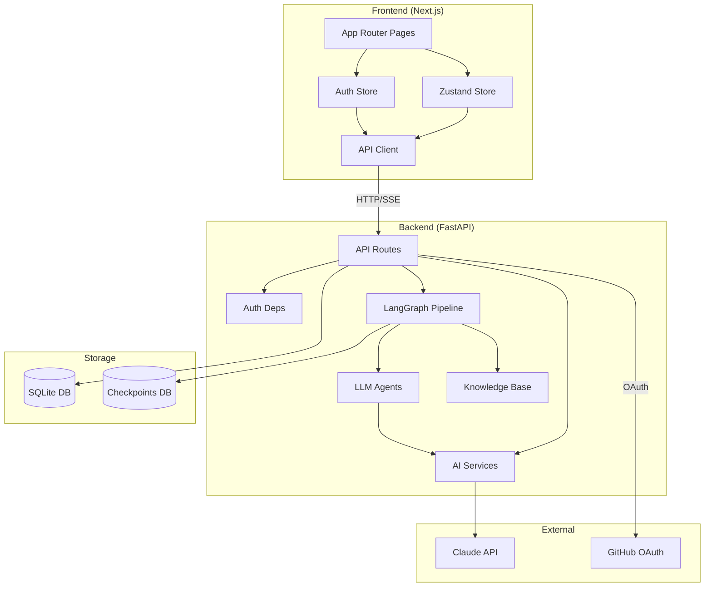
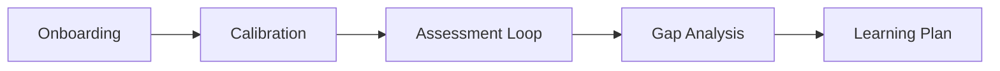

# Architecture Overview

## System Design



## Data Flow

The platform follows a linear pipeline from onboarding to learning plan:



1. **Onboarding** — User selects a role (primary path) or browses and selects skills manually. Skills are mapped to a knowledge base domain.
2. **Calibration** — 3 questions at easy/medium/hard determine the starting level and initial knowledge graph.
3. **Assessment Loop** — Adaptive question-answer cycle builds a detailed knowledge graph through Bloom taxonomy levels.
4. **Gap Analysis** — Current knowledge graph is diffed against the target graph. Gaps are topologically sorted by prerequisites.
5. **Learning Plan** — Claude generates a phased plan from the identified gaps with concrete resources.

### Session Management

A background cleanup task runs during the application's lifespan (started in `main.py`). Every 5 minutes it checks for active sessions whose `updated_at` timestamp is older than 30 minutes and marks them as `timed_out`. This prevents abandoned sessions from accumulating indefinitely. Timed-out sessions return a `410 Gone` response if the client attempts to continue them.

**Source**: `backend/app/services/session_cleanup.py`

### Authentication

Authenticated sessions are linked to users via a `user_id` foreign key. Write endpoints (assessment start, respond, gap analysis, learning plan) are protected by JWT cookie authentication. Read endpoints (graph, report, export) remain public so reports can be shared via URL.

## Tech Stack

| Layer | Technology | Purpose |
|-------|-----------|---------|
| Frontend | Next.js 16 (App Router) | Pages, routing, SSR |
| UI | Tailwind CSS v4, Radix UI, shadcn/ui | Styling and components |
| State | Zustand (sessionStorage) | Client-side state management |
| Charts | Recharts | Proficiency radar charts |
| Animations | Motion v12 | Page transitions and UI animations |
| Backend | FastAPI | API server, SSE streaming |
| Pipeline | LangGraph | State machine with checkpoints and interrupts |
| LLM | LangChain + Anthropic Claude | Question generation, evaluation, plan generation |
| Database | SQLAlchemy + aiosqlite (SQLite) | Session and result storage |
| Checkpoints | LangGraph AsyncSqliteSaver | Pipeline state persistence |
| Auth | python-jose | JWT token signing and verification |
| OAuth | httpx | GitHub OAuth token exchange |
| Encryption | cryptography (Fernet) | API key encryption at rest |

### Why LangGraph?

The assessment pipeline requires:

- **State persistence** — Multi-turn conversations that survive server restarts
- **Human-in-the-loop** — The pipeline pauses for user input at each question
- **Conditional routing** — Dynamic branching based on evaluation results
- **Checkpointing** — Resume from any point in the assessment

LangGraph's `interrupt()` mechanism and `AsyncSqliteSaver` checkpointer handle all of these natively.

### Why Bloom Taxonomy?

[Bloom's taxonomy](https://en.wikipedia.org/wiki/Bloom%27s_taxonomy) provides a structured framework for measuring understanding depth:

| Level | Verb | Assessment Focus |
|-------|------|-----------------|
| Remember | Recall | Definitions, facts |
| Understand | Explain | Concepts, relationships |
| Apply | Use | Practical implementation |
| Analyze | Compare | System-level reasoning |
| Evaluate | Judge | Trade-offs, architecture decisions |
| Create | Design | Novel solutions, system design |

This maps naturally to career progression — junior engineers need to *understand* concepts, while senior engineers need to *evaluate* trade-offs and *create* architectures.

## Directory Structure

```
OpenLearning/
├── backend/
│   ├── app/
│   │   ├── main.py              # FastAPI app, CORS, lifespan, router mounts
│   │   ├── config.py            # Settings (API key, CORS origins, GitHub OAuth, JWT, encryption)
│   │   ├── db.py                # SQLAlchemy models, async engine, session factory
│   │   ├── models/              # Pydantic models (API request/response contracts)
│   │   ├── routes/              # API endpoints (health, skills, assessment, gap_analysis, learning_plan, roles, auth) + export helpers
│   │   ├── deps.py              # Auth dependencies (JWT cookie extraction, user validation, API key injection)
│   │   ├── crypto.py            # Fernet encryption/decryption for API keys
│   │   ├── services/            # AI service layer (structured LLM output, retry, JSON parsing, session cleanup)
│   │   ├── agents/              # LLM agents and output schemas (calibrator, evaluator, question gen, plan gen, schemas)
│   │   ├── graph/               # LangGraph pipeline, state TypedDict, router logic
│   │   ├── knowledge_base/      # Domain YAML files + loader
│   │   ├── data/                # Skills taxonomy definitions
│   │   └── prompts/             # System prompts for Claude (calibration, eval, etc.)
│   ├── tests/                   # pytest test suite
│   ├── Dockerfile               # Backend container image
│   ├── .dockerignore            # Docker build exclusions
│   ├── requirements.txt         # Python dependencies
│   └── pyproject.toml           # Ruff config, project metadata
├── frontend/
│   ├── src/
│   │   ├── app/                 # Next.js App Router pages
│   │   ├── components/
│   │   │   ├── providers/       # React context providers (auth)
│   │   │   ├── settings/        # Settings components (API key setup)
│   │   │   └── ui/              # UI primitives (shadcn/ui)
│   │   ├── hooks/               # Custom React hooks (useAuth, useAssessmentChat, etc.)
│   │   └── lib/                 # Types, Zustand store, auth store, API client, generated types
│   ├── Dockerfile               # Frontend container image
│   ├── .dockerignore            # Docker build exclusions
│   ├── package.json
│   └── eslint.config.mjs
├── scripts/
│   ├── export-openapi.py        # Export OpenAPI spec from FastAPI app
│   ├── generate-api.sh          # OpenAPI → TypeScript type generation
│   ├── forbid-env-files.sh      # Pre-commit hook: block .env file commits
│   └── lint-frontend-staged.sh  # Pre-commit hook: lint staged frontend files
├── docs/                        # Documentation site (MkDocs)
├── docker-compose.yml           # Production-like Docker Compose config
├── docker-compose.dev.yml       # Development Docker Compose overrides (hot-reload)
├── Makefile                     # Dev commands (install, dev, test, lint, fmt, docker)
└── mkdocs.yml                   # MkDocs configuration
```
