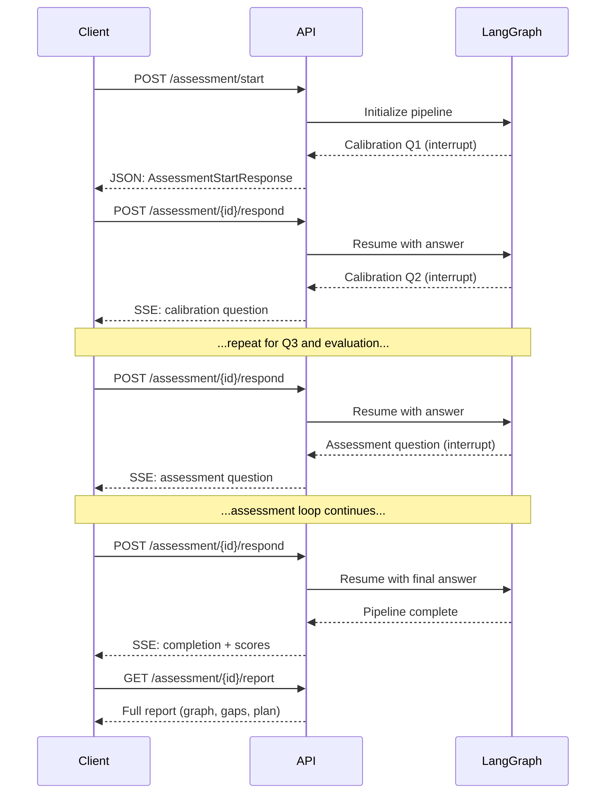

# API Reference

The OpenLearning API is a FastAPI application serving at `http://localhost:8000`. Interactive Swagger docs are available at [`/api/docs`](http://localhost:8000/api/docs).

## Endpoints

### GET `/api/health`

Lightweight health check with database connectivity probe.

**Response** (200):

```json
{"status": "ok", "database": null}
```

**Response** (503 — database unreachable):

```json
{"status": "degraded", "database": "unreachable"}
```

---

### GET `/api/skills`

Returns the full skills taxonomy with categories.

**Response**: `SkillsResponse`

```json
{
  "skills": [
    {
      "id": "nodejs",
      "name": "Node.js",
      "category": "Backend",
      "icon": "...",
      "description": "...",
      "subSkills": ["Express", "Fastify"]
    }
  ],
  "categories": ["Backend", "Frontend", "DevOps"]
}
```

---

### POST `/api/parse-jd`

Extract skills from a job description using AI.

**Request**: `JDParseRequest`

```json
{
  "jobDescription": "We're looking for a senior backend engineer with experience in Node.js, PostgreSQL, and Kubernetes..."
}
```

**Response**: `JDParseResponse`

```json
{
  "skills": ["nodejs", "sql", "kubernetes"],
  "summary": "Senior backend role focusing on Node.js services with PostgreSQL and K8s infrastructure."
}
```

---

### GET `/api/roles`

Returns a list of all available roles (knowledge base domains).

**Response**: `list[RoleSummary]`

```json
[
  {
    "id": "backend_engineering",
    "name": "Backend Engineer",
    "description": "Backend engineering concepts from junior to staff level",
    "skillCount": 18,
    "levels": ["junior", "mid", "senior", "staff"]
  },
  {
    "id": "frontend_engineering",
    "name": "Frontend Engineer",
    "description": "Frontend engineering concepts from junior to staff level",
    "skillCount": 12,
    "levels": ["junior", "mid", "senior", "staff"]
  }
]
```

---

### GET `/api/roles/{role_id}`

Returns detailed information for a single role, including mapped skill IDs and per-level concept counts.

**Path parameter**: `role_id` — the domain identifier (e.g., `backend_engineering`)

**Response** (200): `RoleDetail`

```json
{
  "id": "backend_engineering",
  "name": "Backend Engineer",
  "description": "Backend engineering concepts from junior to staff level",
  "mappedSkillIds": ["nodejs", "python", "java", "go", "rest-api", "graphql", "..."],
  "levels": [
    { "name": "junior", "conceptCount": 13 },
    { "name": "mid", "conceptCount": 15 },
    { "name": "senior", "conceptCount": 17 },
    { "name": "staff", "conceptCount": 15 }
  ]
}
```

**Response** (404 — unknown role):

```json
{ "detail": "Role not found: unknown_role" }
```

---

### POST `/api/assessment/start`

Start a new assessment session. Returns the first calibration question.

**Request body**:

```json
{
  "skillIds": ["nodejs", "rest-api", "sql"],
  "targetLevel": "mid",
  "roleId": "backend_engineering"
}
```

| Field | Type | Required | Description |
|-------|------|----------|-------------|
| `skillIds` | list[string] | Yes | Skill IDs to assess |
| `targetLevel` | string | No (default: `"mid"`) | Target career level |
| `roleId` | string | No | Role/domain ID — when provided, bypasses skill-to-domain mapping and uses the role's knowledge base directly |

**Response**: `AssessmentStartResponse`

```json
{
  "sessionId": "550e8400-e29b-41d4-a716-446655440000",
  "question": "Can you explain what HTTP status codes are and give some examples?",
  "questionType": "calibration",
  "step": 1,
  "totalSteps": 3
}
```

---

### POST `/api/assessment/{session_id}/respond`

Submit an answer and receive the next question (or completion).

**Request body**:

```json
{
  "response": "HTTP is a stateless protocol that uses request-response pairs..."
}
```

**Response** (SSE stream): Events include:

| Event | Description |
|-------|-------------|
| Question event | Next question with metadata (topic, Bloom level, progress) |
| Metadata event | Assessment progress (topics evaluated, total questions) |
| Completion event | Assessment complete with proficiency scores |

**Response** (410 — session timed out):

```json
{"detail": "Session has timed out"}
```

Sessions are marked as timed out after 30 minutes of inactivity. Once timed out, no further responses can be submitted.

---

### GET `/api/assessment/{session_id}/graph`

Get the current knowledge graph for an assessment session.

**Response**: `KnowledgeGraphOut`

```json
{
  "nodes": [
    {
      "concept": "http_fundamentals",
      "confidence": 0.85,
      "bloomLevel": "apply",
      "prerequisites": []
    }
  ]
}
```

---

### GET `/api/assessment/{session_id}/report`

Get the full assessment report. Stores results in the database (idempotent).

**Response**: Full report including knowledge graph, gap nodes, learning plan, and proficiency scores.

---

### POST `/api/gap-analysis`

Generate a gap analysis from proficiency scores.

**Request**: `GapAnalysisRequest`

```json
{
  "proficiencyScores": [
    {
      "skillId": "nodejs",
      "skillName": "Node.js",
      "score": 65,
      "confidence": 0.8,
      "reasoning": "Strong fundamentals, gaps in advanced patterns"
    }
  ]
}
```

**Response**: `GapAnalysis`

```json
{
  "overallReadiness": 72,
  "summary": "Solid foundation with gaps in distributed systems and security.",
  "gaps": [
    {
      "skillId": "microservices",
      "skillName": "Microservices",
      "currentLevel": 45,
      "targetLevel": 80,
      "gap": 35,
      "priority": "critical",
      "recommendation": "Focus on service decomposition and inter-service communication patterns."
    }
  ]
}
```

Priority levels: `critical` (gap > 40), `high` (gap > 25), `medium` (gap > 10), `low` (gap <= 10).

---

### POST `/api/learning-plan`

Generate a personalized learning plan from gap analysis.

**Request**: `LearningPlanRequest`

```json
{
  "gapAnalysis": {
    "overallReadiness": 72,
    "summary": "...",
    "gaps": [...]
  }
}
```

**Response**: `LearningPlan`

```json
{
  "title": "Backend Engineering Growth Plan",
  "summary": "A 6-week plan targeting distributed systems and security gaps.",
  "totalHours": 48,
  "totalWeeks": 6,
  "phases": [
    {
      "phase": 1,
      "name": "Foundations",
      "description": "...",
      "modules": [
        {
          "id": "mod-1",
          "title": "Microservices Fundamentals",
          "description": "...",
          "type": "theory",
          "phase": 1,
          "skillIds": ["microservices"],
          "durationHours": 4,
          "objectives": ["Understand service decomposition", "..."],
          "resources": ["https://microservices.io/patterns"]
        }
      ]
    }
  ]
}
```

## Assessment Flow

The full assessment flow involves multiple API calls:



## SSE Streaming

The `/assessment/{id}/respond` endpoint uses Server-Sent Events (SSE) for streaming responses. The frontend receives events as they're generated, enabling real-time display of questions and progress updates. Note that `/assessment/start` returns a regular JSON response, not SSE.

## Swagger Documentation

For the full interactive API documentation with request/response schemas, run the backend and visit:

**[http://localhost:8000/api/docs](http://localhost:8000/api/docs)**
