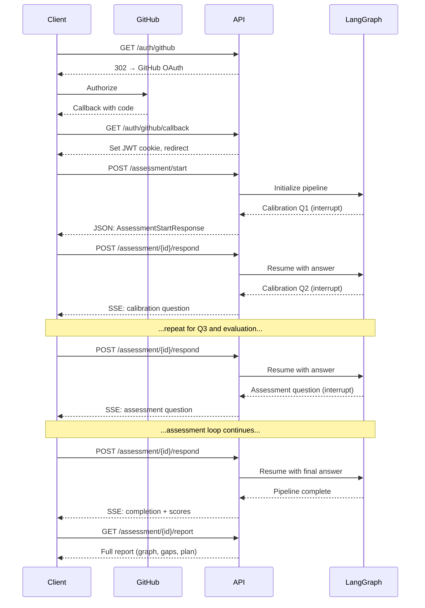

# API Reference

The OpenLearning API is a FastAPI application serving at `http://localhost:8000`. Interactive Swagger docs are available at [`/api/docs`](http://localhost:8000/api/docs).

## Endpoints

### GET `/api/health`

Lightweight health check with database connectivity probe.

**Response** (200):

```json
{"status": "ok", "database": null}
```

**Response** (503 — database unreachable):

```json
{"status": "degraded", "database": "unreachable"}
```

---

### GET `/api/auth/github`

Redirect to GitHub OAuth authorization. Starts the login flow.

**Query parameter**: `redirect` — path to redirect after login (default: `/`)

**Response** (302): Redirects to GitHub's authorization page.

**Response** (501 — GitHub OAuth not configured):

```json
{"detail": "GitHub OAuth is not configured"}
```

---

### GET `/api/auth/github/callback`

Handle the GitHub OAuth callback. Exchanges the authorization code for an access token, upserts the user in the database, and sets an httpOnly JWT cookie.

**Query parameters**:

| Parameter | Required | Description |
|-----------|----------|-------------|
| `code` | Yes | OAuth authorization code from GitHub |
| `state` | Yes | HMAC-signed state parameter for CSRF protection |

**Response** (302): Redirects to the frontend with an `access_token` cookie set.

---

### POST `/api/auth/register`

Register a new account with email and password. Sets an httpOnly JWT cookie on success.

**Request**: `RegisterRequest`

```json
{
  "email": "user@example.com",
  "password": "securepassword"
}
```

**Response** (200):

```json
{"ok": true}
```

Sets an `access_token` httpOnly cookie.

**Response** (400 — password validation failure):

```json
{"detail": "Password must be between 8 and 128 characters"}
```

**Response** (409 — duplicate email):

```json
{"detail": "An account with this email already exists"}
```

**Response** (422 — invalid email format):

Standard FastAPI validation error.

---

### POST `/api/auth/login`

Authenticate with email and password. Sets an httpOnly JWT cookie on success.

**Request**: `LoginRequest`

```json
{
  "email": "user@example.com",
  "password": "securepassword"
}
```

**Response** (200):

```json
{"ok": true}
```

Sets an `access_token` httpOnly cookie.

**Response** (401 — invalid credentials):

```json
{"detail": "Invalid email or password"}
```

---

### GET `/api/auth/me`

> **Requires authentication.** Returns 401 without a valid JWT cookie.

Return the current user's profile.

**Response**: `AuthMeResponse`

```json
{
  "userId": "550e8400-e29b-41d4-a716-446655440000",
  "displayName": "octocat",
  "avatarUrl": "https://avatars.githubusercontent.com/u/1?v=4",
  "hasApiKey": false,
  "email": null
}
```

---

### POST `/api/auth/logout`

Clear the auth cookie.

**Response** (200):

```json
{"ok": true}
```

---

### POST `/api/auth/api-key`

> **Requires authentication.** Returns 401 without a valid JWT cookie.

Store an encrypted API key for the current user.

**Request**: `ApiKeySetRequest`

```json
{
  "apiKey": "sk-ant-..."
}
```

**Response** (200):

```json
{"ok": true}
```

---

### GET `/api/auth/api-key`

> **Requires authentication.** Returns 401 without a valid JWT cookie.

Return a masked preview of the stored API key.

**Response**: `ApiKeyResponse`

```json
{
  "apiKeyPreview": "sk-...ab12"
}
```

**Response** (404 — no API key stored):

```json
{"detail": "No API key stored"}
```

---

### DELETE `/api/auth/api-key`

> **Requires authentication.** Returns 401 without a valid JWT cookie.

Remove the stored API key for the current user. Idempotent — succeeds even if no key is stored.

**Response** (200):

```json
{"ok": true}
```

---

### POST `/api/auth/validate-key`

> **Requires authentication.** Returns 401 without a valid JWT cookie.

Validate an Anthropic API key without storing it. Calls the Anthropic API to verify the key is functional.

**Request**: `ApiKeySetRequest`

```json
{
  "apiKey": "sk-ant-..."
}
```

**Response**: `ValidateKeyResponse`

```json
{"valid": true, "error": null}
```

**Response** (invalid key):

```json
{"valid": false, "error": "Invalid API key"}
```

**Response** (rate limited):

```json
{"valid": false, "error": "Rate limited — key may be valid"}
```

---

#### Auth Models

```python
class AuthMeResponse(CamelModel):
    user_id: str
    display_name: str
    avatar_url: str
    has_api_key: bool
    email: str | None = None

class RegisterRequest(CamelModel):
    email: EmailStr
    password: str

class LoginRequest(CamelModel):
    email: EmailStr
    password: str

class ApiKeySetRequest(CamelModel):
    api_key: str

class ApiKeyResponse(CamelModel):
    api_key_preview: str

class ValidateKeyResponse(CamelModel):
    valid: bool
    error: str | None = None
```

**Source**: `backend/app/routes/auth.py`

---

### GET `/api/skills`

Returns the full skills taxonomy with categories.

**Response**: `SkillsResponse`

```json
{
  "skills": [
    {
      "id": "nodejs",
      "name": "Node.js",
      "category": "Backend",
      "icon": "...",
      "description": "...",
      "subSkills": ["Express", "Fastify"]
    }
  ],
  "categories": ["Backend", "Frontend", "DevOps"]
}
```

---

### GET `/api/roles`

Returns a list of all available roles (knowledge base domains).

**Response**: `list[RoleSummary]`

```json
[
  {
    "id": "backend_engineering",
    "name": "Backend Engineer",
    "description": "Backend engineering concepts from junior to staff level",
    "skillCount": 18,
    "levels": ["junior", "mid", "senior", "staff"]
  },
  {
    "id": "frontend_engineering",
    "name": "Frontend Engineer",
    "description": "Frontend engineering concepts from junior to staff level",
    "skillCount": 12,
    "levels": ["junior", "mid", "senior", "staff"]
  }
]
```

---

### GET `/api/roles/{role_id}`

Returns detailed information for a single role, including mapped skill IDs and per-level concept counts.

**Path parameter**: `role_id` — the domain identifier (e.g., `backend_engineering`)

**Response** (200): `RoleDetail`

```json
{
  "id": "backend_engineering",
  "name": "Backend Engineer",
  "description": "Backend engineering concepts from junior to staff level",
  "mappedSkillIds": ["nodejs", "python", "java", "go", "rest-api", "graphql", "..."],
  "levels": [
    { "name": "junior", "conceptCount": 13 },
    { "name": "mid", "conceptCount": 15 },
    { "name": "senior", "conceptCount": 17 },
    { "name": "staff", "conceptCount": 15 }
  ]
}
```

**Response** (404 — unknown role):

```json
{ "detail": "Role not found: unknown_role" }
```

---

### POST `/api/assessment/start`

> **Requires authentication.** Returns 401 without a valid JWT cookie.
>
> **Requires API key.** Returns 400 if the user has not configured an Anthropic API key.

Start a new assessment session. Returns the first calibration question.

**Request body**:

```json
{
  "skillIds": ["nodejs", "rest-api", "sql"],
  "targetLevel": "mid",
  "roleId": "backend_engineering"
}
```

| Field | Type | Required | Description |
|-------|------|----------|-------------|
| `skillIds` | list[string] | Yes | Skill IDs to assess |
| `targetLevel` | string | No (default: `"mid"`) | Target career level |
| `roleId` | string | No | Role/domain ID — when provided, bypasses skill-to-domain mapping and uses the role's knowledge base directly |

**Response**: `AssessmentStartResponse`

```json
{
  "sessionId": "550e8400-e29b-41d4-a716-446655440000",
  "question": "Can you explain what HTTP status codes are and give some examples?",
  "questionType": "calibration",
  "step": 1,
  "totalSteps": 3
}
```

**Response** (400 — no API key configured):

```json
{"detail": "No API key configured. Please add your Anthropic API key in Settings."}
```

---

### POST `/api/assessment/{session_id}/respond`

> **Requires authentication.** Returns 401 without a valid JWT cookie.
>
> **Requires API key.** Returns 400 if the user has not configured an Anthropic API key.

Submit an answer and receive the next question (or completion).

**Request body**:

```json
{
  "response": "HTTP is a stateless protocol that uses request-response pairs..."
}
```

**Response** (SSE stream): Each event is a line of the form `data: <payload>\n\n`.

| Signal | Payload | Description |
|--------|---------|-------------|
| _(plain text)_ | The question text | Next question streamed as plain text |
| `[META]` + JSON | `{"type":"assessment","step":null,"total_steps":null,"topics_evaluated":3,"total_questions":12,"max_questions":25}` | Assessment progress metadata |
| `[ASSESSMENT_COMPLETE]` | — | Pipeline finished; scores follow |
| _(fenced JSON)_ | `{"scores": ProficiencyScoreOut[]}` JSON object | Proficiency scores wrapped in a `scores` key, inside markdown code fences (sent after `[ASSESSMENT_COMPLETE]`) |
| `[DONE]` | — | Stream complete |
| `[ERROR]` + JSON | `{"status": 429, "detail": "Rate limit reached.", "retryAfter": "30"}` | Structured error with status code, message, and optional retry-after |

**Response** (400 — no API key configured):

```json
{"detail": "No API key configured. Please add your Anthropic API key in Settings."}
```

**Response** (410 — session timed out):

```json
{"detail": "Session has timed out"}
```

Sessions are marked as timed out after 30 minutes of inactivity. Once timed out, no further responses can be submitted.

---

### GET `/api/assessment/{session_id}/graph`

Get the current knowledge graph for an assessment session.

**Response**: `KnowledgeGraphOut`

```json
{
  "nodes": [
    {
      "concept": "http_fundamentals",
      "confidence": 0.85,
      "bloomLevel": "apply",
      "prerequisites": []
    }
  ]
}
```

---

### GET `/api/assessment/{session_id}/report`

Get the full assessment report. Stores results in the database (idempotent).

**Response**: `AssessmentReportResponse`

```json
{
  "knowledgeGraph": {
    "nodes": [
      { "concept": "http_fundamentals", "confidence": 0.85, "bloomLevel": "apply", "prerequisites": [] }
    ]
  },
  "gapNodes": [
    { "concept": "distributed_systems", "currentConfidence": 0.3, "targetBloomLevel": "analyze", "prerequisites": ["networking"] }
  ],
  "learningPlan": {
    "summary": "Focus on distributed systems and security fundamentals.",
    "totalHours": 24.0,
    "phases": [
      {
        "phaseNumber": 1,
        "title": "Foundations",
        "concepts": ["networking", "distributed_systems"],
        "rationale": "Build prerequisite knowledge first.",
        "resources": [{ "type": "article", "title": "Distributed Systems Primer", "url": null }],
        "estimatedHours": 8.0
      }
    ]
  },
  "proficiencyScores": [
    { "skillId": "http_fundamentals", "skillName": "Http Fundamentals", "score": 85, "confidence": 0.85, "reasoning": "Strong understanding demonstrated" }
  ]
}
```

---

### GET `/api/assessment/{session_id}/export`

Export the full assessment report as a formatted Markdown file.

- If the assessment is complete, data is read from the database.
- If the assessment is still in progress, data falls back to the live graph state (sections without data render gracefully with fallback text).

**Response** (200):

- **Content-Type**: `text/markdown`
- **Content-Disposition**: `attachment; filename="assessment-{session_id[:8]}.md"`
- **Body**: Formatted Markdown with sections: Proficiency Scores, Knowledge Map, Knowledge Gaps, Learning Plan.

**Response** (404 — session not found):

```json
{"detail": "Session not found"}
```

---

### GET `/api/assessment/{session_id}/resume`

> **Requires authentication.** Returns 401 without a valid JWT cookie.
>
> **Requires API key.** Returns 400 if the user has not configured an Anthropic API key.

Resume an active assessment session that was interrupted or left incomplete. Loads the pending question from the LangGraph checkpoint.

**Response** (200):

```json
{
  "sessionId": "550e8400-e29b-41d4-a716-446655440000",
  "question": "Can you explain how React hooks work?",
  "questionType": "assessment",
  "step": 4,
  "totalSteps": 5
}
```

**Response** (403 — not your session):

```json
{"detail": "Not your session"}
```

**Response** (404 — session not found):

```json
{"detail": "Session not found"}
```

**Response** (409 — session already completed or no pending question):

```json
{"detail": "Session already completed"}
```

**Response** (410 — session timed out):

```json
{"detail": "Session has timed out"}
```

---

### GET `/api/user/assessments`

> **Requires authentication.** Returns 401 without a valid JWT cookie.

List all assessment sessions for the authenticated user, sorted by creation date (newest first). Includes basic result data for completed sessions.

**Response** (200):

```json
[
  {
    "sessionId": "550e8400-e29b-41d4-a716-446655440000",
    "status": "completed",
    "skillIds": ["react", "typescript"],
    "targetLevel": "mid",
    "roleId": "frontend_engineering",
    "roleName": "Frontend Engineer",
    "createdAt": "2026-03-20T10:30:00Z",
    "completedAt": "2026-03-20T11:45:00Z",
    "overallReadiness": 72,
    "skillCount": 2
  },
  {
    "sessionId": "660e8400-e29b-41d4-a716-446655440001",
    "status": "active",
    "skillIds": ["python"],
    "targetLevel": "mid",
    "roleId": null,
    "roleName": null,
    "createdAt": "2026-03-22T09:00:00Z",
    "completedAt": null,
    "overallReadiness": null,
    "skillCount": 1
  }
]
```

---

### DELETE `/api/user/assessments/{session_id}`

> **Requires authentication.** Returns 401 without a valid JWT cookie.

Delete an assessment session and all associated data (results, materials). Only the session owner can delete it.

**Path Parameters**:

| Parameter | Type | Description |
|-----------|------|-------------|
| `session_id` | string | ID of the session to delete |

**Response** (204): No content.

**Errors**:

| Status | Detail |
|--------|--------|
| 403 | Not your session |
| 404 | Session not found |

---

### POST `/api/gap-analysis`

> **Requires authentication.** Returns 401 without a valid JWT cookie.
>
> **Requires API key.** Returns 400 if the user has not configured an Anthropic API key.

Generate a gap analysis from proficiency scores.

**Request**: `GapAnalysisRequest`

```json
{
  "proficiencyScores": [
    {
      "skillId": "nodejs",
      "skillName": "Node.js",
      "score": 65,
      "confidence": 0.8,
      "reasoning": "Strong fundamentals, gaps in advanced patterns"
    }
  ]
}
```

**Response**: `GapAnalysis`

```json
{
  "overallReadiness": 72,
  "summary": "Solid foundation with gaps in distributed systems and security.",
  "gaps": [
    {
      "skillId": "microservices",
      "skillName": "Microservices",
      "currentLevel": 45,
      "targetLevel": 80,
      "gap": 35,
      "priority": "critical",
      "recommendation": "Focus on service decomposition and inter-service communication patterns."
    }
  ]
}
```

Priority levels: `critical` (gap > 40), `high` (gap > 25), `medium` (gap > 10), `low` (gap <= 10).

**Response** (400 — no API key configured):

```json
{"detail": "No API key configured. Please add your Anthropic API key in Settings."}
```

---

### POST `/api/learning-plan`

> **Requires authentication.** Returns 401 without a valid JWT cookie.
>
> **Requires API key.** Returns 400 if the user has not configured an Anthropic API key.

Generate a personalized learning plan from gap analysis.

**Request**: `LearningPlanRequest`

```json
{
  "gapAnalysis": {
    "overallReadiness": 72,
    "summary": "...",
    "gaps": [...]
  }
}
```

**Response**: `LearningPlan`

```json
{
  "summary": "A 6-week plan targeting distributed systems and security gaps.",
  "totalHours": 48,
  "phases": [
    {
      "phaseNumber": 1,
      "title": "Foundations",
      "concepts": ["microservices", "http_fundamentals"],
      "rationale": "Build foundational understanding before tackling distributed systems.",
      "resources": [
        {
          "type": "article",
          "title": "Microservices Fundamentals",
          "url": "https://microservices.io/patterns"
        },
        {
          "type": "video",
          "title": "HTTP Deep Dive",
          "url": null
        }
      ],
      "estimatedHours": 12
    }
  ]
}
```

**Response** (400 — no API key configured):

```json
{"detail": "No API key configured. Please add your Anthropic API key in Settings."}
```

---

### GET `/api/materials/{session_id}`

> **Requires authentication.** Returns 401 without a valid JWT cookie.

Retrieve generated learning materials for a completed assessment session. Materials are generated automatically in the background when an assessment completes.

**Path parameter**: `session_id` — the assessment session UUID

**Response** (200): `MaterialsResponse`

```json
{
  "sessionId": "550e8400-e29b-41d4-a716-446655440000",
  "materials": [
    {
      "conceptId": "http_fundamentals",
      "domain": "backend_engineering",
      "bloomScore": 0.91,
      "qualityScore": 0.88,
      "iterationCount": 1,
      "qualityFlag": null,
      "material": {
        "concept_id": "http_fundamentals",
        "target_bloom": 2,
        "sections": [
          {"type": "explanation", "title": "What HTTP does", "body": "..."},
          {"type": "code_example", "title": "HTTP Request", "body": "...", "codeBlock": "..."},
          {"type": "quiz", "title": "Check understanding", "body": "...", "answer": "..."}
        ]
      },
      "generatedAt": "2026-03-23T12:00:00Z"
    }
  ]
}
```

An empty `materials` list indicates the pipeline is still running.

**Response** (404 — session not found):

```json
{"detail": "Session not found"}
```

**Source**: `backend/app/routes/materials.py`

---

## Anthropic Error Responses

When the backend encounters an Anthropic SDK exception, it maps it to a structured HTTP error:

| Anthropic Exception | HTTP Status | Message |
|---------------------|-------------|---------|
| `AuthenticationError` | 401 | Your API key is invalid or has been revoked. Please update it in settings. |
| `RateLimitError` | 429 | Rate limit reached. Please wait a moment and try again. (`Retry-After` header included) |
| `APIConnectionError` | 502 | Unable to reach the AI service. Please try again shortly. |
| `APITimeoutError` | 504 | The AI service timed out. Please try again. |
| `InternalServerError` | 502 | The AI service encountered an error. Please try again. |

Applies to `/assessment/start`, `/assessment/{id}/respond`, `/gap-analysis`, `/learning-plan`. For SSE streams, errors arrive as `data: [ERROR]{json}\n\n` instead of HTTP status codes.

**Source**: `backend/app/main.py` (`register_anthropic_error_handlers`), `backend/app/services/ai.py` (`classify_anthropic_error`)

---

## Assessment Flow

The full assessment flow involves multiple API calls:



## SSE Streaming

The `/assessment/{id}/respond` endpoint uses Server-Sent Events (SSE) for streaming responses. The frontend receives events as they're generated, enabling real-time display of questions and progress updates. Note that `/assessment/start` returns a regular JSON response, not SSE.

## Swagger Documentation

For the full interactive API documentation with request/response schemas, run the backend and visit:

**[http://localhost:8000/api/docs](http://localhost:8000/api/docs)**
